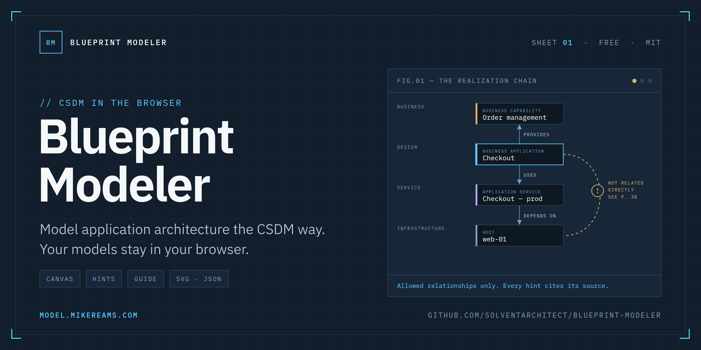
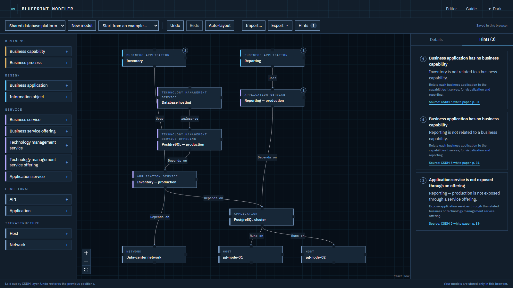
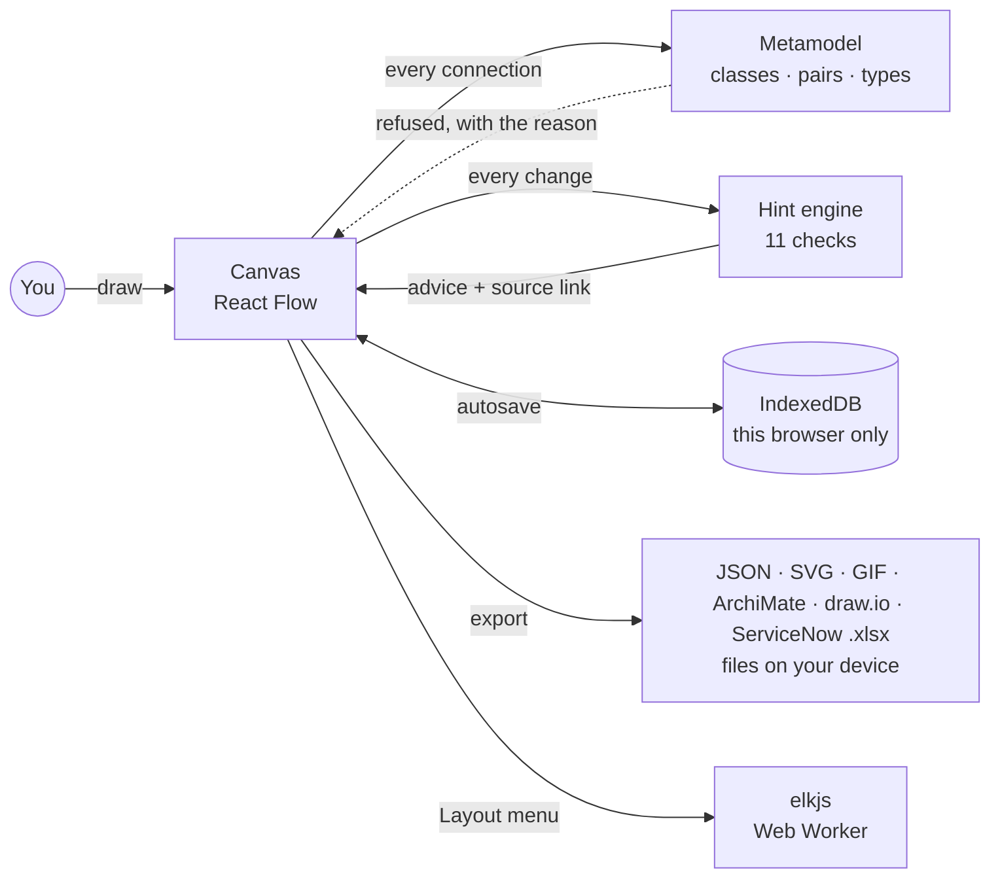

<p align="center">
  <a href="https://model.mikereams.com">
    <picture>
      <source media="(prefers-color-scheme: dark)" srcset="assets/banner-dark.png">
      <source media="(prefers-color-scheme: light)" srcset="assets/banner-light.png">
      
    </picture>
  </a>
</p>

<p align="center">
  <a href="https://model.mikereams.com"></a>
  <a href="https://github.com/solventarchitect/blueprint-modeler/actions/workflows/ci.yml"></a>
  <a href="https://github.com/solventarchitect/blueprint-modeler/releases/latest"></a>
  <a href="LICENSE"></a>
  <a href="https://model.mikereams.com/guide"></a>
</p>

<p align="center"><b>A free, browser-only canvas for modeling application architecture with ServiceNow's Common Service Data Model. No sign-up, no server: it offers only the relationships CSDM uses, and every hint cites its public source.</b></p>

---

## Why this exists

Most CSDM conversations start with a box for an application, a box for a server, and a line between them. That line is the problem: the model exists to put an Application Service between those two boxes, and the rule that says so sits deep in a long white paper.

General diagramming tools will draw any line you ask for. Blueprint Modeler knows the model. It places each element in its CSDM layer, lets you connect only the pairs CSDM relates, and flags common gaps as you draw, with a link to the page each rule came from. It is built for people learning CSDM and for architects sketching a design before anything exists in an instance.

<p align="center">
  <picture>
    <source media="(prefers-color-scheme: dark)" srcset="assets/screenshot-dark.png">
    <source media="(prefers-color-scheme: light)" srcset="assets/screenshot-light.png">
    
  </picture>
</p>

## What it does

| Feature | What you get |
|---|---|
| **Palette by layer** | 25 classes: 19 from the CSDM 5 white paper, from Business Capability to Host and Network, including the CSDM 5 Service Instance family (Application Service plus Data, Connection, Network, Operational Process and Facility Service Instances), and 6 CMDB Kubernetes classes (Cluster, Node, Namespace, Workload, Service, Pod), marked CMDB. Placed in lanes from business at the top to infrastructure at the bottom. Turn on View › Extended classes for 11 more from the white paper: strategy (Strategic Priority, Goal, Target, Product Idea, Planning Item), Value Stream and Stage, SDLC Component, Product Model, AI Application and AI Function; and 12 CMDB classes from ServiceNow's product documentation: server virtualization (VMware vCenter Instance, Datacenter, Cluster and Datastore, ESX Server, VMware Virtual Machine Instance) and security (Firewall Device, Firewall Cluster, Load Balancer, Virtual Private Network, Unique Certificate, Active Directory Domain Controller). |
| **Allowed relationships only** | Connect two elements and choose from the types CSDM uses for that pair (101 pairs, typed from the white paper's relationship figure where it names them). While you drag, the line turns green with the relationship type over a valid target, or red with the reason over an invalid one, before you let go. |
| **Conformance hints** | 11 checks, such as a Business Application with no Business Capability, a service instance nobody can request, an offering with no parent service, or a capability hierarchy deeper than six levels. Hints advise rather than block, highlight the elements involved and link to their source. |
| **Class guide** | [Every class, relationship and hint](https://model.mikereams.com/guide) on one page, with its source and how well the public text supports each relationship type, plus how impact travels along each relationship. Filter it by words, layer or kind; each class links to the classes it connects to (`/guide#business-application`), and the Inspector links the selected element to its class. |
| **Examples** | Fifteen models to start from, grouped by category in the Examples menu. Application architecture: an online store checkout, an HR portal, a shared database platform and an enterprise AI assistant (three trigger hints on purpose). Security architecture: an internet edge and DMZ, directory and sign-in services, and remote access VPN. ServiceNow platform: ServiceNow modeled as a platform in its own CMDB — service management, instances and MID Servers, and integrations. Reference architecture: containerization (a storefront on Kubernetes), server virtualization and virtual desktops (VDI). Frameworks and metamodel: a claims system read purely in ArchiMate, and the CSDM 5 core metamodel itself: every white-paper class and each relationship allowed between them. All fictional. Link straight to one with `/editor?example=<id>`, e.g. [`/editor?example=checkout`](https://model.mikereams.com/editor?example=checkout). The ids, in Artifact ID order (BM-EX-001 …): `checkout`, `hr-portal`, `db-platform`, `kubernetes`, `enterprise-ai`, `dmz-edge`, `directory`, `remote-access`, `servicenow-itsm`, `servicenow-instances`, `servicenow-integrations`, `server-virtualization`, `vdi`, `archimate-claims`, `csdm5-metamodel`. |
| **Import and export** | A versioned JSON model file that round-trips exactly, standalone SVG images in light or dark for docs and slides, headed by the model's title block, an ArchiMate® Model Exchange File that opens in Archi and other ArchiMate tools, and a draw.io file that opens in draw.io or imports into Lucidchart (shapes, colors, labels and connected lines; Lucid does not keep the CSDM properties as shape data), with a count of Lucid objects against the Lucid Free plan's per-document limit. A ServiceNow import workbook (.xlsx): one sheet per CMDB table with each element's name and description, a cmdb_rel_ci sheet for relationships, a references sheet, and a README sheet with the import steps. While a blast radius is open, an animated GIF of it. |
| **Layout menu** | Five arrangements, all by CSDM layer and each a single undo step: Auto-layout (ELK, in a background worker), Top to bottom (one row per layer), Left to right (one column per layer; lanes become columns and relationships run sideways), Symmetric (every layer centered on one axis) and Fill space (the picture stretched to the shape of the view). |
| **ArchiMate lens** | Switch to CSDM + ArchiMate 3.2 and every element also shows its mapped ArchiMate element and notation icon; relationships read in ArchiMate terms. ArchiMate 3.2 only hides the CSDM names on the canvas: elements are headed by their ArchiMate type and filled with their ArchiMate layer color, and relationships carry their ArchiMate name and notation (diamonds, dashed realizations, open serving arrows), with a legend. View-only: files stay in CSDM terms. |
| **Layer boxes, lanes and present mode** | A translucent box around each CSDM layer, optional full-width lanes that keep a dropped element in its own layer, snap to a 16px grid, a line style for relationships (curved, or right angles; images and GIFs follow it), and Present: a full-screen walk through the model, layer by layer, with the arrow keys. Drag a layer's label to move the layer with everything in it. |
| **Suggestions** | A new element with no relationships offers what it can connect to (elements already on the canvas first, then the next CSDM classes) and adds the element and relationship in one click. While you draw a line, every element it can be dropped on is outlined. |
| **Right-click menus** | Menus for whatever you click: an element (rename, relate, duplicate, delete), a relationship (update an older one to its CSDM 5 type), a layer (zoom, select, distribute evenly, delete), or the canvas. Shift+F10 opens them from the keyboard. |
| **Share a link** | Export › Copy link to this model puts the whole model in a link (`/editor#model=…`, compressed in your browser). Whoever opens it gets their own copy, saved in their browser as an import would be; the model travels after the `#`, which browsers never send to a server. The shipped examples make links of 1–2 KB; past 8,000 characters the copy warns that some chat and email apps cut long links, and past 100,000 a model file is the way. |
| **Your models** | Every model is saved as you work, in this browser only. The Model menu lists them with each one's Artifact ID, the start of its description, its size and when it last changed; choose one to open it. Manage… downloads a JSON copy, or deletes one or all (it asks first). |
| **Title block** | Every model carries a date (the day it was made, until you change it on the Details tab), and optionally a description and an Artifact ID. They appear with its name above the diagram — on the canvas, when presenting, and in SVG images and GIFs; the optional parts nowhere when left empty. The examples come with a description and a sequenced Artifact ID (BM-EX-001 to BM-EX-015). |
| **Read this model** | The Read tab beside Hints says every relationship as a sentence, worded for the lens and scoped to the selected element. Choose a sentence to highlight that relationship on the canvas. |
| **Blast radius** | Right-click an element, or use the Inspector, and choose Show blast radius: the element is marked failed, then each hop of elements that depend on it lights up in turn, with its relationships' dashes running the way impact travels. Switch to Dependencies to see what the element needs instead. Play, pause or step through it, with a list of every hop; with reduced motion it shows the whole radius at once. Export › Blast radius animation (GIF) saves it as an animated image, made in your browser. The [impact rules](https://model.mikereams.com/guide#impact) are in the guide with their evidence: one direction is stated in ServiceNow-hosted material, the rest are conventional readings. It is a what-if on your model, not ServiceNow's Impacted Services calculation. |
| **Data flow** | Right-click a Business Capability or Business Process (or use the Inspector) and choose Show data flow: data travels from it step by step, in its own color, through everything it relies on down to the hosts — the same walk as its dependencies, told the other way round. Play, pause or step through it; Export › Data flow animation (GIF) saves it, one frame a step, made in your browser. |
| **Focus and descriptions** | Select an element and everything it connects to, with those relationships, is shaded. Hover an element to highlight it and show its description underneath, while its own relationships run the way impact travels: what it depends on, and what depends on it. Each element has a description field. |
| **Keyboard and themes** | Every canvas action has a keyboard path. Auto, light and dark themes. Checked against WCAG 2.2 AA. |

<p align="center">
  <picture>
    <source media="(prefers-color-scheme: dark)" srcset="assets/screenshot-archimate-dark.png">
    <source media="(prefers-color-scheme: light)" srcset="assets/screenshot-archimate-light.png">
    
  </picture>
</p>

<p align="center">
  <picture>
    <source media="(prefers-color-scheme: dark)" srcset="assets/screenshot-blast-dark.png">
    <source media="(prefers-color-scheme: light)" srcset="assets/screenshot-blast-light.png">
    
  </picture>
</p>

## How it works



Three rules shape the code:

| Rule | What it means in practice | Where it lives |
|---|---|---|
| **Every rule needs a source** | Each class, relationship and hint carries a link to public ServiceNow material; a test fails the build if one doesn't. | `src/metamodel/` |
| **Say what the source says** | Relationship types are marked *reported* (the public text names them) or *conventional* (a standard CMDB type for that pair). | `src/metamodel/relationships.ts` |
| **Advise, don't block** | Only pairs CSDM never relates are refused. Everything softer is a hint, and an imported model that breaks the rules still loads. | `src/model/hints.ts` |

## Clean-room by design

Every class, relationship and hint is written in our own words from ServiceNow's public material: mainly the CSDM 5 white paper, ServiceNow Community posts, and the product documentation for the Kubernetes, virtualization and security classes. Nothing comes from any employer, customer or instance, and the app never connects to a ServiceNow instance. Contributions must follow the same rule: public source, linked, in your own words.

## Privacy

The app is a static site with no accounts and no cookies. Models are stored in your browser (IndexedDB) and never sent anywhere; import, export and auto-layout run on your device. The live site counts visits with cookieless Cloudflare Web Analytics. Details: [model.mikereams.com/privacy](https://model.mikereams.com/privacy).

## Quick start

Use it at **[model.mikereams.com](https://model.mikereams.com)**, or run it yourself:

```bash
pnpm install
pnpm dev        # http://localhost:3000
```

Needs Node 22.12 or later and pnpm 11. The production build is a static export in `out/` that any static host can serve:

```bash
pnpm build
pnpm serve      # serves out/ on http://127.0.0.1:3000
```

## Verify

```bash
pnpm verify
```

Runs the same gates as CI: typecheck, lint, unit tests (model, metamodel sources, hints, import/export, layout), the static build, then Playwright against the built site. The browser tests cover the hero flow, keyboard paths, an accessibility scan of every page in both themes, a check that nothing loads from another origin, and no horizontal scroll at five screen widths.

## Releases

The live site deploys from `main` on every merge. [GitHub releases](https://github.com/solventarchitect/blueprint-modeler/releases) group finished milestones into versions (semantic versioning, matching `package.json`), and the milestone table in [SPEC.md](SPEC.md) records what each one changed and how it was verified.

## What's inside

```text
src/
  metamodel/    CSDM classes, relationship pairs and types, hint catalog, impact rules, sources
  model/        model schema (zod), parse and migrate, hint engine, blast radius
  editor/       canvas, palette, inspector, hints and read panels, blast radius view, notation legend, undo/redo state
  frameworks/   ArchiMate 3.2 lens: element and relationship mapping, notation, layer colors
  io/           JSON import/export, SVG, GIF (in-repo encoder, in a worker), ArchiMate, draw.io and ServiceNow export, Lucid plan fit
  layout/       ELK graph, Web Worker engine, shared edge routing
  storage/      IndexedDB store (memory fallback)
  examples/     the fifteen starter models
  guide/        class guide helpers: anchors, kinds, links, filter
  app/          pages: home, editor, guide, about, privacy
e2e/            Playwright specs (axe, network, keyboard, import/export, layout)
assets/         README banner, screenshots, social preview
```

<details>
<summary><b>The model file format</b></summary>

A model is plain JSON. Positions live in a `layout` sidecar keyed by element id, so the model itself stays diff-friendly. Files carry a `schema` version; older versions are migrated on import.

```json
{
  "schema": 1,
  "id": "3f6c…",
  "name": "Online Store Checkout",
  "created": "2026-09-27T12:00:00.000Z",
  "updated": "2026-09-27T12:00:00.000Z",
  "nodes": [
    { "id": "ba", "class": "business_application", "name": "Checkout" },
    { "id": "svc", "class": "application_service", "name": "Checkout — production" }
  ],
  "edges": [{ "id": "e1", "from": "ba", "to": "svc", "type": "Uses::Used by" }],
  "layout": { "ba": { "x": 0, "y": 160 }, "svc": { "x": 0, "y": 320 } }
}
```

</details>

## Built with

[Next.js](https://nextjs.org) (static export) · TypeScript · [React Flow](https://reactflow.dev) · [elkjs](https://github.com/kieler/elkjs) · [zod](https://zod.dev) · Tailwind CSS · IBM Plex · Vitest · Playwright · Vercel

## Contributing

Issues and pull requests are welcome; see [CONTRIBUTING.md](CONTRIBUTING.md). For metamodel changes (a class, relationship or hint), use the [rule correction](https://github.com/solventarchitect/blueprint-modeler/issues/new?template=rule_correction.yml) form: include the public ServiceNow source and page, and describe the rule in your own words. Run `pnpm verify` before opening a pull request. Everyone taking part agrees to the [Code of Conduct](CODE_OF_CONDUCT.md); report security problems privately as described in [SECURITY.md](SECURITY.md).

## License

[MIT](LICENSE) © 2026 [Mike Reams](https://mikereams.com). IBM Plex fonts: SIL Open Font License (see `src/fonts/README.md`). Auto-layout uses [elkjs](https://github.com/kieler/elkjs) (unmodified, EPL-2.0), loaded in a Web Worker only when you choose a layout.

Not affiliated with or endorsed by ServiceNow, The Open Group, Lucid Software or JGraph (draw.io). ServiceNow and CSDM are trademarks of ServiceNow, Inc.; ArchiMate® is a registered trademark of The Open Group. They are used here only to describe what the tool models.
