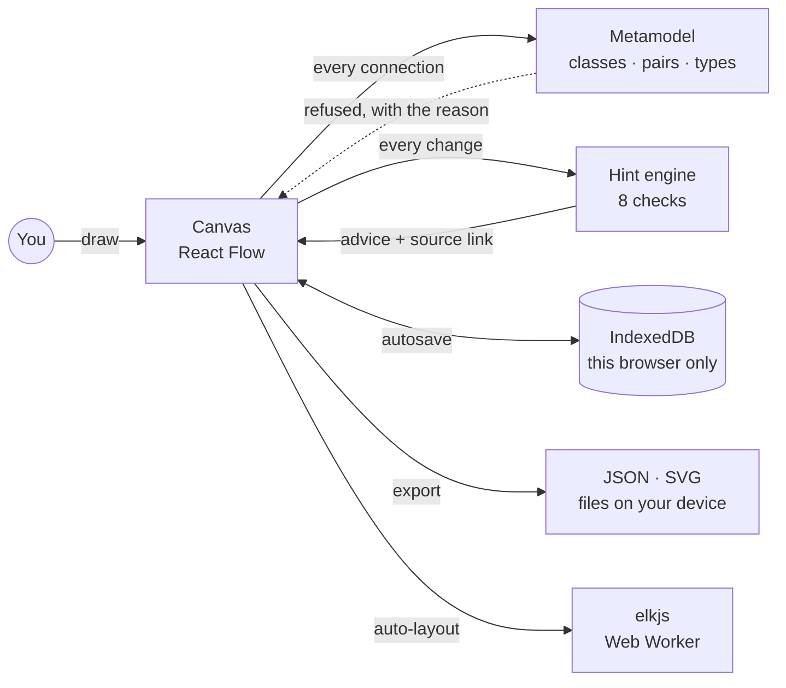

<p align="center">
  <a href="https://model.mikereams.com">
    <picture>
      <source media="(prefers-color-scheme: dark)" srcset="assets/banner-dark.png">
      <source media="(prefers-color-scheme: light)" srcset="assets/banner-light.png">
      
    </picture>
  </a>
</p>

<p align="center">
  <a href="https://model.mikereams.com"></a>
  <a href="https://github.com/solventarchitect/blueprint-modeler/actions/workflows/ci.yml"></a>
  <a href="LICENSE"></a>
  <a href="https://model.mikereams.com/guide"></a>
</p>

<p align="center"><b>A free, browser-only canvas for modeling application architecture with ServiceNow's Common Service Data Model. No sign-up, no server: it offers only the relationships CSDM uses, and every hint cites its public source.</b></p>

---

## Why this exists

Most CSDM conversations start with a box for an application, a box for a server, and a line between them. That line is the problem: the model exists to put an application service between those two boxes, and the rule that says so sits deep in a long white paper.

General diagramming tools will draw any line you ask for. Blueprint Modeler knows the model. It places each element in its CSDM layer, lets you connect only the pairs CSDM relates, and flags common gaps as you draw, with a link to the page each rule came from. It is built for people learning CSDM and for architects sketching a design before anything exists in an instance.

<p align="center">
  <picture>
    <source media="(prefers-color-scheme: dark)" srcset="assets/screenshot-dark.png">
    <source media="(prefers-color-scheme: light)" srcset="assets/screenshot-light.png">
    
  </picture>
</p>

## What it does

| Feature | What you get |
|---|---|
| **Palette by layer** | 13 CSDM classes, from business capability to host and network, placed in lanes from business at the top to infrastructure at the bottom. |
| **Allowed relationships only** | Connect two elements and choose from the types CSDM uses for that pair (16 pairs). A pair CSDM does not relate is refused with the reason. |
| **Conformance hints** | 8 checks, such as a business application with no capability, a service nobody can request, or a capability hierarchy deeper than six levels. Hints advise rather than block, highlight the elements involved and link to their source. |
| **Class guide** | [Every class, relationship and hint](https://model.mikereams.com/guide) on one page, with its source and how well the public text supports each relationship type. |
| **Examples** | Three fictional models to start from: a clean checkout, and two that trigger hints on purpose. |
| **Import and export** | A versioned JSON model file that round-trips exactly, plus standalone SVG images in light or dark for docs and slides. |
| **Auto-layout** | One click lays the model out top-down by CSDM layer, in a background worker, as a single undo step. |
| **Keyboard and themes** | Every canvas action has a keyboard path. Auto, light and dark themes. Checked against WCAG 2.2 AA. |

## How it works



Three rules shape the code:

| Rule | What it means in practice | Where it lives |
|---|---|---|
| **Every rule needs a source** | Each class, relationship and hint carries a link to public ServiceNow material; a test fails the build if one doesn't. | `src/metamodel/` |
| **Say what the source says** | Relationship types are marked *reported* (the public text names them) or *conventional* (a standard CMDB type for that pair). | `src/metamodel/relationships.ts` |
| **Advise, don't block** | Only pairs CSDM never relates are refused. Everything softer is a hint, and an imported model that breaks the rules still loads. | `src/model/hints.ts` |

## Clean-room by design

Every class, relationship and hint is written in our own words from ServiceNow's public CSDM material, mainly the CSDM 5 white paper and ServiceNow Community posts. Nothing comes from any employer, customer or instance, and the app never connects to a ServiceNow instance. Contributions must follow the same rule: public source, linked, in your own words.

## Privacy

The app is a static site with no accounts and no cookies. Models are stored in your browser (IndexedDB) and never sent anywhere; import, export and auto-layout run on your device. The live site counts visits with cookieless Cloudflare Web Analytics. Details: [model.mikereams.com/privacy](https://model.mikereams.com/privacy).

## Quick start

Use it at **[model.mikereams.com](https://model.mikereams.com)**, or run it yourself:

```bash
pnpm install
pnpm dev        # http://localhost:3000
```

Needs Node 22.12 or later and pnpm 11. The production build is a static export in `out/` that any static host can serve:

```bash
pnpm build
pnpm serve      # serves out/ on http://127.0.0.1:3000
```

## Verify

```bash
pnpm verify
```

Runs the same gates as CI: typecheck, lint, unit tests (model, metamodel sources, hints, import/export, layout), the static build, then Playwright against the built site. The browser tests cover the hero flow, keyboard paths, an accessibility scan of every page in both themes, a check that nothing loads from another origin, and no horizontal scroll at five screen widths.

## What's inside

```text
src/
  metamodel/    CSDM classes, relationship pairs and types, hint catalog, sources
  model/        model schema (zod), parse and migrate, hint engine
  editor/       canvas, palette, inspector, hints panel, undo/redo state
  io/           JSON import/export, SVG export
  layout/       ELK graph, Web Worker engine, shared edge routing
  storage/      IndexedDB store (memory fallback)
  examples/     the three starter models
  app/          pages: home, editor, guide, about, privacy
e2e/            Playwright specs (axe, network, keyboard, import/export, layout)
assets/         README banner, screenshots, social preview
```

<details>
<summary><b>The model file format</b></summary>

A model is plain JSON. Positions live in a `layout` sidecar keyed by element id, so the model itself stays diff-friendly. Files carry a `schema` version; older versions are migrated on import.

```json
{
  "schema": 1,
  "id": "3f6c…",
  "name": "Online store checkout",
  "created": "2026-09-27T12:00:00.000Z",
  "updated": "2026-09-27T12:00:00.000Z",
  "nodes": [
    { "id": "ba", "class": "business_application", "name": "Checkout" },
    { "id": "svc", "class": "application_service", "name": "Checkout — production" }
  ],
  "edges": [{ "id": "e1", "from": "ba", "to": "svc", "type": "Uses::Used by" }],
  "layout": { "ba": { "x": 0, "y": 160 }, "svc": { "x": 0, "y": 320 } }
}
```

</details>

## Built with

[Next.js](https://nextjs.org) (static export) · TypeScript · [React Flow](https://reactflow.dev) · [elkjs](https://github.com/kieler/elkjs) · [zod](https://zod.dev) · Tailwind CSS · IBM Plex · Vitest · Playwright · Vercel

## Contributing

Issues and pull requests are welcome. For metamodel changes (a class, relationship or hint), include the public ServiceNow source and page, and describe the rule in your own words. Run `pnpm verify` before opening a pull request.

## License

[MIT](LICENSE) © 2026 [Mike Reams](https://mikereams.com). IBM Plex fonts: SIL Open Font License (see `src/fonts/README.md`). Auto-layout uses [elkjs](https://github.com/kieler/elkjs) (unmodified, EPL-2.0), loaded in a Web Worker only when you click Auto-layout.

Not affiliated with or endorsed by ServiceNow. ServiceNow and CSDM are trademarks of ServiceNow, Inc., used here only to describe what the tool models.
